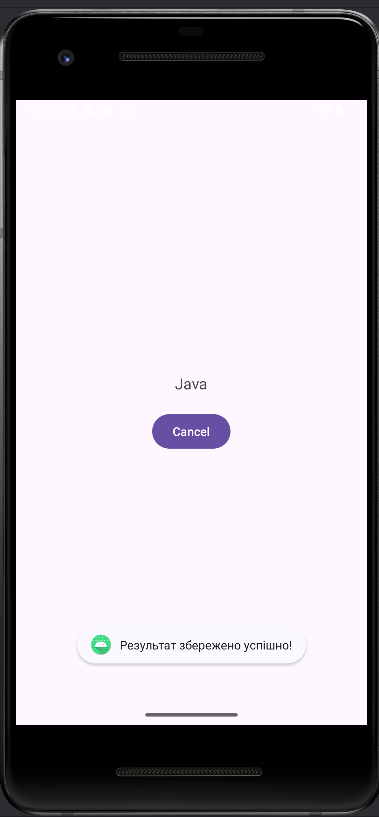
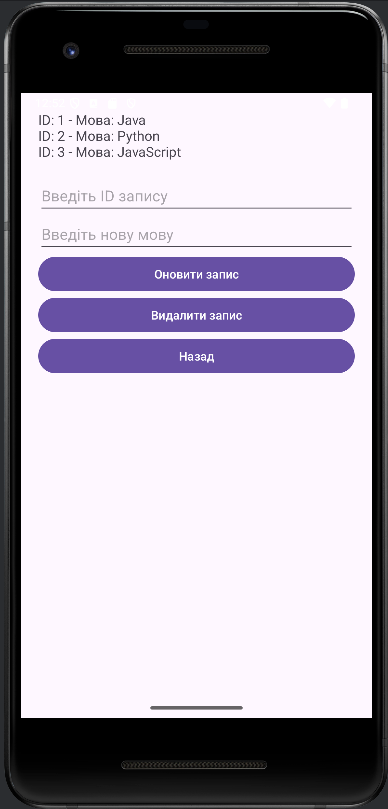
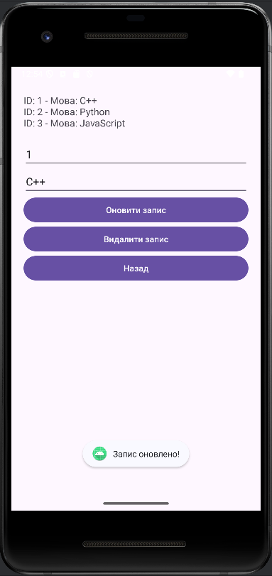
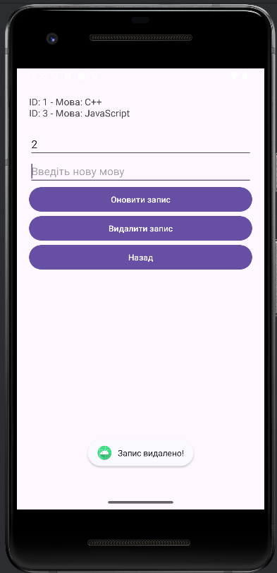
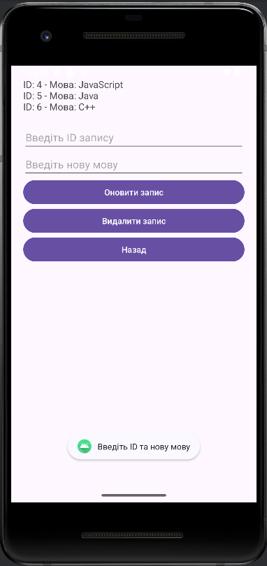
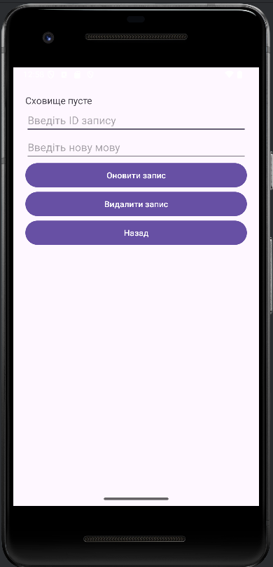

# Лабораторна робота №3

Виконала студентка ІО-25, Борисенко Таміла

## Мета роботи:
Метою цієї лабораторної роботи є дослідження способів збереження даних (бази даних, файлова система тощо) в Android, а також отримання практичних навичок роботи зі сховищами даних. Особлива увага приділяється взаємодії між інтерфейсом користувача та базою даних.

## Завдання:
1. Написати Android-додаток, який:
   - Записує результат взаємодії з інтерфейсом до сховища (SQLite база даних) при натисканні кнопки **"ОК"**.
   - Інформує користувача про успішність запису.
   - Має кнопку **"Відкрити"**, що відкриває активність для перегляду даних зі сховища.
2. Реалізувати додаткові функції:
   - Оновлення та видалення записів у сховищі.
   - Також була додана кнопка **"Назад"** у активності перегляду даних для повернення до основного екрану.

## Опис роботи:

### 1. Оновлення існуючих файлів:
- **`InputFragment.java`**:
  - Додано збереження даних у SQLite при натисканні кнопки **"ОК"**.
  - Кнопка **"Відкрити"** додає функціонал переходу до активності `DataActivity`.
- **Макет `fragment_input.xml`**:
  - Додано нову кнопку **"Відкрити"** для доступу до перегляду даних.

### 2. Реалізація нових компонентів:
- **Клас `DatabaseHelper.java`**:
  - Створений для роботи з базою даних SQLite. Реалізує методи:
    - Додавання даних (`insertLanguage`).
    - Отримання всіх даних (`getAllLanguages`).
    - Оновлення записів (`updateLanguage`).
    - Видалення записів (`deleteLanguage`).
- **Активність `DataActivity.java`**:
  - Відображає всі записи зі сховища.
  - Дозволяє оновлювати та видаляти записи за ID.
  - Містить кнопку **"Назад"** для повернення до попереднього екрана.
- **Макет `activity_data.xml`**:
  - Додано елементи:
    - Поле для введення ID запису.
    - Поле для введення нової мови.
    - Кнопки для оновлення, видалення та повернення назад.

### 3. Опис структури та файли проекту:
1. **MainActivity.java**:
   - Відповідає за управління фрагментами.
2. **InputFragment.java**:
   - Реалізує вибір мови користувачем і взаємодію з базою даних.
3. **ResultFragment.java**:
   - Відображає вибраний результат.
4. **DataActivity.java**:
   - Відображає дані, дозволяє їх оновлювати, видаляти.
5. **DatabaseHelper.java**:
   - Робота з базою даних SQLite.
6. **activity_main.xml**:
   - Макет для основної активності.
7. **fragment_input.xml**:
   - Макет для введення даних.
8. **fragment_result.xml**:
   - Макет для відображення результату.
9. **activity_data.xml**:
   - Макет для перегляду, оновлення та видалення даних.
10. **strings.xml**:
    - Строки інтерфейсу користувача.

### 4. Логіка роботи програми:
- Запуск програми починається з **MainActivity**, де завантажується фрагмент **InputFragment**.
- У **InputFragment**:
  - Користувач вибирає мову програмування.
  - Натискання на **"ОК"**:
    - Результат зберігається у базі даних.
    - Виводиться повідомлення про успішність запису.

    
    
  - Натискання на **"Відкрити"** відкриває нову активність **DataActivity**.
- У **DataActivity**:
  - Відображаються всі дані зі сховища.

  

  - Користувач може оновити запис, ввівши ID та нову мову.

  

  - Може видалити запис, ввівши ID.

  

  - Якщо при натисканні **"Оновити запис"** ID та/або нова мова не введена, то користувач бачить повідомлення **"Введіть ID та нову мову"**
  
  

  - Якщо при натисканні **"Видалити запис"** ID не введене, то користувач бачить повідомлення **"Введіть ID"**
  
  

  - Якщо сховище пусте, виводиться повідомлення **"Сховище пусте"**, яке інформує користувача про відсутність записів.
  
  

  - Повернутися назад до **InputFragment** можна кнопкою **"Назад"**.

## Висновок:
У ході виконання лабораторної роботи були досліджені різні способи збереження даних у сховищах Android, зокрема використання SQLite. Реалізація функціоналу для запису, перегляду, оновлення та видалення даних дозволила закріпити практичні знання та навички, необхідні для роботи з базами даних. Ця робота стала логічним продовженням попередньої, додаючи більше функціоналу та можливостей для інтерактивності.